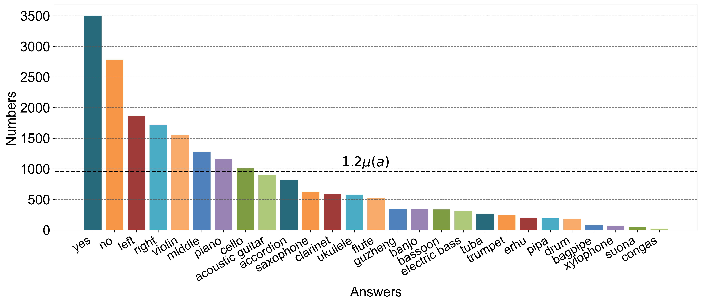

# Look, Listen, and Answer: Overcoming Biases for Audio-Visual Question Answering
This repository contains the ***MUSIC-AVQA-R*** dataset , as proposed in [Look, Listen, and Answer: Overcoming Biases for Audio-Visual Question Answering](https://arxiv.org/abs/2404.12020), as well as the code implementation of ***the Multifaceted Cycle Collaborative Debiasing (MCCD)*** method.

<div align=center></div>

<center>Figure 1: Robust AVQA architecture to overcome bias learning. Our MCCD strategy is plug-and-play,allowing seamless integration with other AVQA methods.</center>

## Dataset

We introduce the first dataset, ***MUSIC-AVQA-R***, to evaluate the robustness of AVQA models. The construction of this dataset involves two key processes: *rephrasing* and *splitting*. The former involves the rephrasing of questions in the test split of [***MUSIC-AVQA***](https://github.com/GeWu-Lab/MUSIC-AVQA), and the latter is dedicated to the categorization of questions into frequent (head) and rare (tail) subset. 

We followed the previous work in partitioning the dataset into "head" and "tail" categories. Based on the number of answers in the dataset, answers with a count greater than $1.2$ times the mean, denoted as $\mu(a)$, were categorized as "head" while those with counts less than  $1.2\mu(a)$ were categorized as "tail"

The sizes of our MUSIC-AVQA-R dataset are presented in **Table 1** and **Table 2**. We present it based on different question scenarios and question types.

<center>Table 1. Test split comparison between MUSIC-AVQA and MUSIC-AVQA-R. EXIST, LOC, CNT, COMP, and TEMP, which are question types, denote “Existential”, “Location”, “Counting”, “Comparative”, and “Temporal”, respectively.</center>

<div align=center></div>

<center>Table 2. The sizes of head and tail subsets for different question types in MUSIC-AVQA-R, which are divided based on their corresponding  μ(a).</center>

<div align=center></div>

- example

  <div align=center></div>

<center>Figure 2: Answer distributions of the "location" type of questions in the AVQA task. μ(a) is the average number of answers in the group</center>

In this scenario, answers such as "yes," "no," "left," and others, whose total count exceeds $1.2\mu(a)$, are divided as "head." The remaining answers such as "accordion", "tuba" and so forth, are divided as "tail."

### Training Set and Validation Set

Download [here](https://github.com/GeWu-Lab/MUSIC-AVQA/tree/main/data/json_update).

The dataset modifications exclusively pertain to the test split of [***MUSIC-AVQA***](https://github.com/GeWu-Lab/MUSIC-AVQA), thus leaving the training set and validation set unchanged.

### Test Set 

Download [here](./dataset/MUSIC-AVQA-R). 

We utilized the [QuillBot](https://quillbot.com/paraphrasing-tool) to rephrase each question in the ***MUSIC-AVQA*** dataset 25 times. Subsequently, three annotators independently voted on whether the rephrased questions retained semantic equivalence with the original questions. Questions receiving two or more votes were retained. The Fleiss Kappa value, indicating the consistency of this voting process, was *0.849*. Ultimately, *92.4%* of the questions were preserved. In ***MUSIC-AVQA-R***'s test set, compared to ***MUSIC-AVQA***, the number of questions expanded from *9,129* to *211,572*, and the vocabulary of questions increased from *93* to *465*.

**Figure 2** displays the first three words in ***MUSIC-AVQA-R*** and ***MUSIC-AVQA***. Intuitively, we observe that questions in ***MUSIC-AVQA-R*** are more diverse than those in ***MUSIC-AVQA*** in terms of their expression.

<div align=center></div>

<center>Figure 3:  Distribution visualization of questions based on the first three words.</center>

- Demo

	<div align=center ></div>

<center>Figure 4. Demo in MUISC-AVQA-R</center>

In the test set demo, we include audio, video, and corresponding questions. In this example, the question template is "**Is the <Object> in the video always playing?**" After rephrasing with the tool, the question becomes "**Does the cello in the video play all the time**," which maintains the same meaning as the original question but with a different expression.

## Usage

### Getting Started

```bash
$ conda create --name <env> --file requirements.txt
```

### Download Features of Videos and Audios

Download [here](https://github.com/GeWu-Lab/MUSIC-AVQA/tree/main/feat_script).

We directly utilized the audio and video features provided in ***MUSIC-AVQA***. We extend our gratitude to the authors for open-sourcing them!

### Training

1. set hyper parameters in [option.yaml](./option.yaml),  configure the `run_mode` parameter as "**train**", and specify the parameters under the `path` section.
2. ```bash
    python main.py
    ```

### Evaluation

1. set hyper parameters in [option.yaml](./option.yaml),  configure the `run_mode` parameter as "**test**", and specify the parameters under the `path` section.

2. ```bash
   python main.py
   ```

## Case Study


<center>Figure 5. Attention weight visualization on the uniformly sampled audio and video frames. We can see that our method can focus on the key audio and video frames for QA simultaneously in both in- and out-of-distribution settings</center>

## Citation

If you find our work useful in your research, please consider citing:

```tex
@article{ma2024look,
  title={Look, Listen, and Answer: Overcoming Biases for Audio-Visual Question Answering},
  author={Ma, Jie and Hu, Min and Wang, Pinghui and Sun, Wangchun and Song, Lingyun and Pei, Hongbin and Liu, Jun and Du, Youtian},
  journal={arXiv preprint arXiv:2404.12020},
  year={2024}
}
```

## Acknowledgement

The dataset presented in this paper is built upon the  [***MUSIC-AVQA***](https://github.com/GeWu-Lab/MUSIC-AVQA). We extend our gratitude to the authors for open-sourcing their work.
